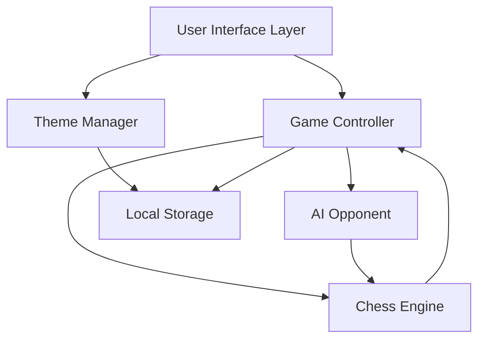

# Design Document: Web Chess Application

## Overview

The web chess application is a browser-based chess game that allows users to play against an AI opponent with two difficulty modes. The application is built using modern web technologies with a focus on clean architecture, responsive design, and an intuitive user experience inspired by Hugging Face's design system.

The system consists of several key components:
- A chess engine for move validation and game state management
- An AI opponent with configurable difficulty levels
- A responsive UI with theme support
- A move history and game state display system

## Architecture

### High-Level Architecture



### Component Responsibilities

**User Interface Layer**
- Renders the chess board and pieces
- Handles user interactions (clicks, touches)
- Displays game state information
- Provides controls for game management

**Game Controller**
- Orchestrates game flow between player and AI
- Manages turn-based play
- Coordinates between UI, Engine, and AI components
- Handles game lifecycle (start, end, reset)

**Chess Engine**
- Validates move legality according to chess rules
- Maintains the current game state
- Detects check, checkmate, and stalemate conditions
- Generates lists of valid moves for pieces
- Implements special moves (castling, en passant, promotion)

**AI Opponent**
- Generates moves based on current board state
- Implements difficulty-specific behavior
- Evaluates board positions
- Applies move restrictions based on difficulty mode

**Theme Manager**
- Manages light/dark mode switching
- Persists theme preferences
- Applies theme-specific styling

## Components and Interfaces

### Chess Engine

```typescript
interface Position {
  row: number;  // 0-7
  col: number;  // 0-7
}

interface Piece {
  type: 'pawn' | 'knight' | 'bishop' | 'rook' | 'queen' | 'king';
  color: 'white' | 'black';
  position: Position;
  hasMoved: boolean;  // For castling and pawn double-move
}

interface Move {
  from: Position;
  to: Position;
  piece: Piece;
  capturedPiece?: Piece;
  isEnPassant?: boolean;
  isCastling?: boolean;
  promotionType?: 'queen' | 'rook' | 'bishop' | 'knight';
}

interface GameState {
  board: (Piece | null)[][];  // 8x8 grid
  currentTurn: 'white' | 'black';
  moveHistory: Move[];
  capturedPieces: Piece[];
  isCheck: boolean;
  isCheckmate: boolean;
  isStalemate: boolean;
  moveCount: number;
}

interface ChessEngine {
  // Initialize a new game
  initializeGame(): GameState;
  
  // Get all valid moves for a piece at a position
  getValidMoves(position: Position, state: GameState): Position[];
  
  // Validate if a move is legal
  isValidMove(move: Move, state: GameState): boolean;
  
  // Execute a move and return new game state
  executeMove(move: Move, state: GameState): GameState;
  
  // Check if a position is under attack
  isPositionUnderAttack(position: Position, byColor: 'white' | 'black', state: GameState): boolean;
  
  // Detect check condition
  isInCheck(color: 'white' | 'black', state: GameState): boolean;
  
  // Detect checkmate condition
  isCheckmate(color: 'white' | 'black', state: GameState): boolean;
  
  // Detect stalemate condition
  isStalemate(state: GameState): boolean;
  
  // Get all legal moves for a color
  getAllLegalMoves(color: 'white' | 'black', state: GameState): Move[];
}
```

### AI Opponent

```typescript
type DifficultyMode = 'easy' | 'hard';

interface AIConfig {
  difficulty: DifficultyMode;
  maxThinkingTime: number;  // milliseconds
}

interface AIOpponent {
  // Generate the best move for the current position
  generateMove(state: GameState, config: AIConfig): Promise<Move>;
  
  // Evaluate a board position (higher is better for AI)
  evaluatePosition(state: GameState): number;
  
  // Check if a move would result in checkmate
  wouldResultInCheckmate(move: Move, state: GameState): boolean;
}
```

### Game Controller

```typescript
interface GameController {
  // Start a new game
  startNewGame(difficulty: DifficultyMode): void;
  
  // Handle player move attempt
  handlePlayerMove(move: Move): Promise<void>;
  
  // Request AI to make a move
  requestAIMove(): Promise<void>;
  
  // Get current game state
  getGameState(): GameState;
  
  // Resign current game
  resignGame(): void;
  
  // Subscribe to game state changes
  onStateChange(callback: (state: GameState) => void): void;
}
```

### Theme Manager

```typescript
type Theme = 'light' | 'dark';

interface ThemeConfig {
  // Board colors
  lightSquare: string;
  darkSquare: string;
  highlightColor: string;
  validMoveIndicator: string;
  
  // UI colors
  background: string;
  foreground: string;
  border: string;
  buttonPrimary: string;
  buttonSecondary: string;
  text: string;
  textSecondary: string;
}

interface ThemeManager {
  // Get current theme
  getCurrentTheme(): Theme;
  
  // Set theme
  setTheme(theme: Theme): void;
  
  // Toggle between themes
  toggleTheme(): void;
  
  // Get theme configuration
  getThemeConfig(theme: Theme): ThemeConfig;
  
  // Subscribe to theme changes
  onThemeChange(callback: (theme: Theme) => void): void;
}
```

## Data Models

### Board Representation

The chess board is represented as an 8x8 two-dimensional array where:
- Index [0][0] represents square a8 (top-left, black's back rank)
- Index [7][7] represents square h1 (bottom-right, white's back rank)
- Each cell contains either a Piece object or null (empty square)

### Move History

Moves are stored in algebraic notation and as structured Move objects:
- Standard algebraic notation (e.g., "e4", "Nf3", "O-O")
- Full move objects for state reconstruction
- Captured pieces tracked separately for display

### State Persistence

Game state is persisted to browser localStorage:
- Current game state (if game in progress)
- Theme preference
- Optional: game history for review

## Error Handling

### Move Validation Errors

**Invalid Move Attempts**
- When a player attempts an invalid move, the UI provides visual feedback
- The piece returns to its original position with a subtle animation
- No state change occurs
- Error is logged for debugging but not shown to user

**Illegal Position Errors**
- If the game state becomes corrupted, reset to last valid state
- If no valid state exists, offer to start a new game
- Log error details for debugging

### AI Errors

**Move Generation Timeout**
- If AI takes longer than maxThinkingTime, select a random valid move
- Log timeout for performance monitoring
- Display message to user: "AI is taking longer than expected"

**No Valid Moves Available**
- Should not occur if checkmate/stalemate detection works correctly
- If it does occur, declare game as draw
- Log error for investigation

### Network and Storage Errors

**localStorage Unavailable**
- Application continues to function without persistence
- Theme defaults to light mode
- Display warning: "Settings will not be saved"

**State Corruption**
- Validate state structure on load
- If invalid, discard and start fresh
- Log corruption details

## Testing Strategy

### Overview

The testing strategy employs both unit tests and property-based tests to ensure correctness. Unit tests verify specific examples and edge cases, while property-based tests validate universal properties across many generated inputs.

### Property-Based Testing

We will use a property-based testing library appropriate for our chosen implementation language (e.g., fast-check for TypeScript/JavaScript, Hypothesis for Python). Each property test will run a minimum of 100 iterations to ensure comprehensive coverage through randomization.

Each property test will be tagged with a comment referencing its corresponding design property:
```
// Feature: web-chess-app, Property 1: Move validation preserves game rules
```

### Unit Testing

Unit tests will focus on:
- Specific move scenarios (e.g., castling, en passant, pawn promotion)
- Edge cases (e.g., stalemate positions, insufficient material)
- Error conditions (e.g., invalid input handling)
- Integration between components
- UI interactions and state updates

### Test Coverage Areas

**Chess Engine Tests**
- Move generation for each piece type
- Special moves (castling, en passant, promotion)
- Check detection
- Checkmate detection
- Stalemate detection
- Move validation

**AI Opponent Tests**
- Easy mode checkmate avoidance
- Hard mode move restriction (first 10 moves)
- Move generation within time limits
- Position evaluation consistency

**Game Controller Tests**
- Turn management
- Game flow orchestration
- State transitions

**UI Tests**
- Piece selection and movement
- Valid move highlighting
- Theme switching
- Responsive layout

**Integration Tests**
- Complete game flows
- Player vs AI interaction
- State persistence and recovery


## Correctness Properties

*A property is a characteristic or behavior that should hold true across all valid executions of a system—essentially, a formal statement about what the system should do. Properties serve as the bridge between human-readable specifications and machine-verifiable correctness guarantees.*

### Chess Engine Properties

**Property 1: Valid move highlighting**
*For any* board state and any piece, when that piece is selected, all highlighted positions should be valid legal moves for that piece according to chess rules.
**Validates: Requirements 1.1**

**Property 2: Invalid move rejection preserves state**
*For any* game state and any invalid move, attempting that move should result in the game state remaining completely unchanged.
**Validates: Requirements 1.2**

**Property 3: Check detection accuracy**
*For any* board state where a king is under attack and has no blocking moves, the Chess_Engine should correctly identify that the king is in check.
**Validates: Requirements 1.3**

**Property 4: Checkmate detection accuracy**
*For any* board state where a king is in check and has no legal moves to escape check, the Chess_Engine should correctly identify checkmate and declare the game over.
**Validates: Requirements 1.4**

**Property 5: Stalemate detection accuracy**
*For any* board state where the current player has no legal moves but is not in check, the Chess_Engine should correctly identify stalemate and declare a draw.
**Validates: Requirements 1.5**

**Property 6: Turn alternation**
*For any* game state, after executing a valid move, the current turn should switch to the opposite color.
**Validates: Requirements 1.6**

### AI Opponent Properties

**Property 7: Easy mode generates valid moves**
*For any* board state in easy mode, the move generated by the AI_Opponent should be a legal move according to chess rules.
**Validates: Requirements 2.1**

**Property 8: Easy mode avoids checkmate**
*For any* board state in easy mode where a checkmate move is available, the AI_Opponent should not select that move.
**Validates: Requirements 2.2**

**Property 9: Easy mode response time**
*For any* board state in easy mode, the AI_Opponent should generate and return a move within 2 seconds.
**Validates: Requirements 2.5**

**Property 10: Hard mode pre-move-10 checkmate restriction**
*For any* board state in hard mode where fewer than 10 moves have been played and a checkmate move is available, the AI_Opponent should not select that move.
**Validates: Requirements 3.2**

**Property 11: Hard mode post-move-10 checkmate execution**
*For any* board state in hard mode where 10 or more moves have been played and a checkmate move is available, the AI_Opponent should select that move.
**Validates: Requirements 3.3**

**Property 12: Hard mode response time**
*For any* board state in hard mode, the AI_Opponent should generate and return a move within 3 seconds.
**Validates: Requirements 3.4**

### UI and Interaction Properties

**Property 13: Piece highlight on selection**
*For any* piece on the board, when that piece is clicked, the UI should apply a visual highlight to that piece.
**Validates: Requirements 4.3**

**Property 14: Move animation**
*For any* valid move executed by the player, the UI should animate the piece moving from its source position to its destination position.
**Validates: Requirements 4.5**

**Property 15: Captured pieces display**
*For any* game state with captured pieces, the UI should display all captured pieces in the designated capture area.
**Validates: Requirements 4.6**

**Property 16: Turn indicator accuracy**
*For any* game state, the UI should display a turn indicator that matches the current turn (player or AI).
**Validates: Requirements 4.7**

**Property 17: Theme persistence round-trip**
*For any* theme selection (light or dark), after setting the theme and reloading the application, the theme should remain the same as what was selected.
**Validates: Requirements 5.4**

**Property 18: New game resets state**
*For any* game state, clicking the new game button should reset the game state to the standard starting position with all pieces in their initial locations.
**Validates: Requirements 6.2**

**Property 19: Resignation ends game**
*For any* in-progress game state, selecting the resign option should immediately end the game and declare the AI as the winner.
**Validates: Requirements 6.5**

**Property 20: Difficulty display accuracy**
*For any* game state, the displayed difficulty mode should match the actual difficulty mode that was selected when the game started.
**Validates: Requirements 6.6**

**Property 21: Move number display accuracy**
*For any* game state, the displayed move number should equal the number of moves that have been played in the current game.
**Validates: Requirements 7.1**

**Property 22: Move history accuracy**
*For any* game state, the displayed move history should contain all moves that have been played in the correct order with proper algebraic notation.
**Validates: Requirements 7.2**

**Property 23: Game result display**
*For any* ended game state (checkmate, stalemate, or resignation), the UI should display the correct result type and winner (if applicable).
**Validates: Requirements 7.3**

**Property 24: AI thinking indicator**
*For any* game state where it is the AI's turn and the AI has not yet completed its move, the UI should display a visual indicator that the AI is thinking.
**Validates: Requirements 7.4**

**Property 25: Responsive scaling**
*For any* screen width between 320px and 2560px, the game board should scale appropriately and remain fully visible and playable.
**Validates: Requirements 8.1**

**Property 26: Resize preserves state**
*For any* game state, resizing the viewport should preserve the complete game state including piece positions, move history, and turn order.
**Validates: Requirements 8.3**

**Property 27: Input method equivalence**
*For any* piece selection or move action, using touch events should produce the same result as using mouse click events.
**Validates: Requirements 8.4**

### Edge Case Properties

These properties focus on specific edge cases that are important to handle correctly:

**Property 28: Castling validation**
*For any* board state where castling conditions are met (king and rook haven't moved, no pieces between them, king not in check, king doesn't pass through check), castling should be allowed; otherwise it should be rejected.
**Validates: Requirements 1.7**

**Property 29: En passant validation**
*For any* board state where en passant conditions are met (opponent pawn just moved two squares, capturing pawn is on correct rank), en passant should be allowed; otherwise it should be rejected.
**Validates: Requirements 1.7**

**Property 30: Pawn promotion**
*For any* pawn that reaches the opposite end of the board, the player should be prompted to select a promotion piece (queen, rook, bishop, or knight), and the pawn should be replaced with the selected piece.
**Validates: Requirements 1.7**
